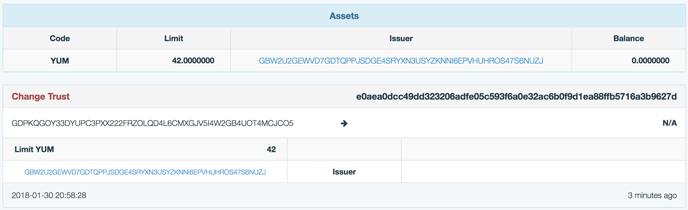
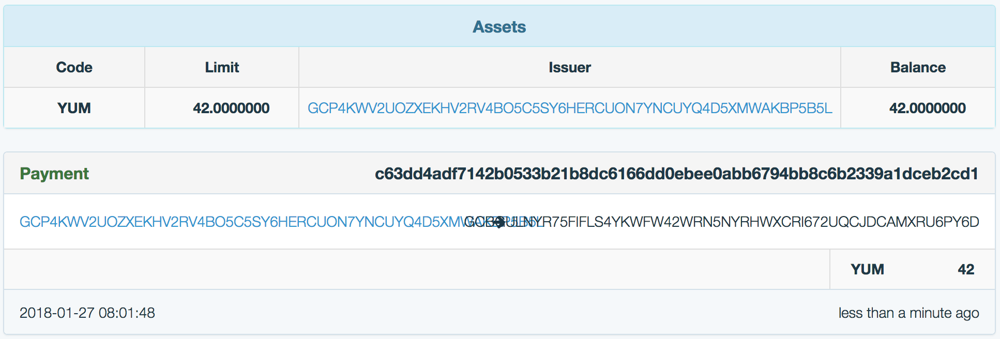
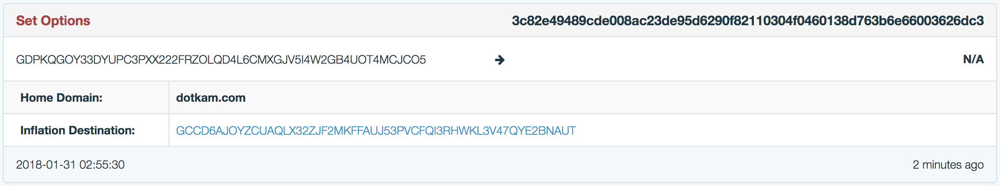

# Beebee Ate

[](https://travis-ci.org/tolitius/bb8)

A command line interface to [Stellar](https://www.stellar.org/) networks.

- [Why](#why)
- [Installation](#installation)
  - [Homebrew](#homebrew)
  - [Download, Unpack, Go](#download-unpack-go)
  - [Or just Go](#or-just-go)
- [Choose Stellar Network](#choose-stellar-network)
- [Buttons to Push](#buttons-to-push)
- [Create Account Keys](#create-account-keys)
- [Create Account](#create-account)
  - [Funding Test Account](#funding-test-account)
  - [Creating New Account](#creating-new-account)
- [Account Details](#account-details)
- [Issue a New Token](#issue-a-new-token)
  - [Issuer and Distributor](#issuer-and-distributor)
  - [Creating and funding accounts](#creating-and-funding-accounts)
  - [Do You Trust Me?](#do-you-trust-me)
  - [Limit Trustline](#limit-trustline)
- [Send Payments](#send-payments)
  - [Send Non Native Assets](#send-non-native-assets)
  - [Send Native Assets](#send-native-assets)
  - [Add Memo](#add-memo)
- [Transaction Options](#transaction-options)
  - [Add Discoverablity and Meta Information](#add-discoverablity-and-meta-information)
  - [Inflation Destination](#inflation-destination)
  - [Set and Clear Flags](#set-and-clear-flags)
  - [Thresholds](#thresholds)
  - [Master Weight](#master-weight)
  - [Add and Remove Signers](#add-and-remove-signers)
- [Stream Stellar Events](#stream-stellar-events)
- [Help](#help)
- [License](#license)

## Why

There are already mutiple ways to interact with Stellar:

* [REST API](https://www.stellar.org/developers/horizon/reference/index.html)
* [SDK libraries](https://www.stellar.org/developers/reference/#libraries) in several languages
* [Stellar Labratory](https://www.stellar.org/laboratory/)

BB-8 adds a command line / terminal capabilities to the Stellar family of tools. This is useful for exploration as well as the real world interaction with Stellar networks.

Command line shells are interactive by design and have a very rich and familiar set of tools that could be applied to Stellar API directly, ranging from simple account details:

```sh
$ bb load-account GADGVH6PHMF2UGVHO446SHQR2WUJEELRBSDPRQBP7K63WJBKMV5MFX2F |
                  jq '.inflation_destination, .balances'

"GCCD6AJOYZCUAQLX32ZJF2MKFFAUJ53PVCFQI3RHWKL3V47QYE2BNAUT"
{
  "balance": "42.0000000",
  "limit": "42.0000000",
  "asset_type": "credit_alphanum4",
  "asset_code": "YUM",
  "asset_issuer": "GDK5BSGYV2XFMO6H7OFTZDLJ2LFXTGMZLC4267OJQ4EASOFDBCELGBOA"
},
{
  "balance": "10041.9999400",
  "asset_type": "native"
}
```

to rollups and runtime stats:

```sh
$ bb stream --transactions GADGVH6PHMF2UGVHO446SHQR2WUJEELRBSDPRQBP7K63WJBKMV5MFX2F |
            grep --line-buffered fee_paid |
            awk -F" " '{rollup+=$2; print "total fees paid: "rollup}'

total fees paid: 100
total fees paid: 300
total fees paid: 500
total fees paid: 700
total fees paid: 900
total fees paid: 1000
total fees paid: 1100
```

Stellar has great API, command line shells have Turing complete power, they make a lovely couple.

## Installation

There are multiple ways to install BB-8. The easiest one is with [Homebrew](https://brew.sh/):

### Homebrew

```sh
$ brew tap tolitius/bb8
```

```sh
$ brew install bb8
==> Downloading https://github.com/tolitius/bb8/releases/download..
######################################################################## 100.0%
🍺  /usr/local/Cellar/bb8[version]: 4 files, 7.7MB, built in 3 seconds
```

and BB-8 is ready to rock:

```sh
$ bb --help
```

### Download, Unpack, Go

If Homebrew is not an option grab a BB-8 release from [here](https://github.com/tolitius/bb8/releases) that matches your operating system.

Unpack it:

```sh
tar -xvzf bb8_[version]_[OS].tar.gz
```

and go:

```sh
$ ./bb --help  ##  or "bb.exe --help" on Windows
```

### Or just Go

If you have Golang installed, you could simply:

```sh
$ go get github.com/tolitius/bb8
```

a runnable `bb` will be under `$GOBIN`:

```sh
$ $GOBIN/bb --help
```

Or clone the repo and `go build` it if you prefer a bare minimum.

## Choose Stellar Network

By default BB-8 uses the Stellar [test network](https://www.stellar.org/developers/guides/concepts/test-net.html) a.k.a. testnet.

In case the work needs to be done on the Stellar public network a `STELLAR_NETWORK` environment variable should be set to "`public`":

```sh
$ export STELLAR_NETWORK=public
```

If `STELLAR_NETWORK` is unset or is set to "`test`" a testnet will be used.

> _TODO: add support for custom / private Stellar networks (URL + passphrase)_

## Buttons to Push

``` sh
$ bb --help
```
```
BB-8 is a command line interface to Stellar (https://www.stellar.org/) networks.

Usage:
  bb [command]

Available Commands:
  change-trust   create, update, or delete a trustline
  create-account creates a new account
  fund           fund a test account
  gen-keys       create a pair of keys (in two files "file-name.pub" and "file-name")
  help           Help about any command
  load-account   load and return account details
  new-tx         build and submit a new transaction
  send-payment   send payment from one account to another
  set-options    set options on the account
  stream         stream "ledger", "payment" and "tranasaction" events
  submit-tx      submit a base64 encoded transaction
  version        print the version number of bb

Flags:
  -h, --help   help for bb

Use "bb [command] --help" for more information about a command.
```

## Create Account Keys

Every Stellar account has a pair of keys:

* a public key that is also known as account's `address`
* a private key that is also known as `seed`

BB-8 has a `gen-keys` command to generate this pair of keys:

``` sh
$ bb gen-keys foo
2018/01/30 15:15:46 keys are created and stored in: foo.pub and foo
```

`foo` in this case is a path to a pair of files where these keys will be stored:

```sh
$ echo address: $(cat foo.pub); echo seed: $(cat foo)
address: GBTG5ZSVAG6LNKA5ZGMD4SJYJX4AQI347WYURPHZV7A6DC7FCG44DOMY
seed: SAWDCNZF7Y67RWT5FC6YSAHFRH23OFU2OFYFXFNWYETL7S7J72CWK6JG
```

An account `seed` should be kept private, hence the "`private`" key.
It is later used to _sign_ Stellar transactions to confirm that it is "_really you_" and "_you approve_" the transaction.

## Create Account

Once the account keys are generated there are two ways to create / record an account in the Stellar ledger:

* Using Stellar's Friendbot to fund a new _test_ account address on the testnet
* Using an existing account by sending a small token amount to a new account address

### Funding Test Account

Stellar has a friendly utility called [Friendbot](https://www.stellar.org/developers/horizon/reference/tutorials/follow-received-payments.html#funding-your-account) that funds a new account on the Stellar test network. When a new account is created (e.g. a pair of keys we created above), this account has no balance and does not exist in the ledger until it is funded. Friendbot fixes that problem.

BB-8 has `fund` command that takes an account's address and funds it a good amount of lumens:

``` sh
$ bb fund $(cat foo.pub)
```

here we used a `foo.pub` address that we generated above. We'll look at this account on the real, distributed Stellar ledger in the [Account Details](#account-details) section.

### Creating New Account

BB-8 has `create-account` command that takes a source account's seed, a new account address, an initial amount and creates a new account.

Since a new account needs an address before it can be created, let's generate keys for it:

```sh
$ bb gen-keys bar
2018/01/30 15:17:12 keys are created and stored in: bar.pub and bar
```

At this moment this new account "bar" does _not yet exist_ on the Stellar ledger, and would need to be "created".

Since account "foo" was funded lumens in the step above it could be used as a source account to create "bar":

```sh
$ bb create-account '{"source_account":"'$(cat foo)'", "new_account":"'$(cat bar.pub)'", "amount":"1.5"}'
```

this would create a new "bar" account by sending 1.5 XLM to it from an account "foo".

## Account Details

In order to look at the account in the ledger BB-8 provides an `load-account` command that takes an account address and returns all the details known to Stellar:

```sh
$ bb load-account $(cat foo.pub)
```
```json
{
  "_links": {
    "self": {
      "href": "https://horizon-testnet.stellar.org/accounts/GBTG5ZSVAG6LNKA5ZGMD4SJYJX4AQI347WYURPHZV7A6DC7FCG44DOMY"
    },
    "transactions": {
      "href": "https://horizon-testnet.stellar.org/accounts/GBTG5ZSVAG6LNKA5ZGMD4SJYJX4AQI347WYURPHZV7A6DC7FCG44DOMY/transactions{?cursor,limit,order}",
      "templated": true
    },
    "operations": {
      "href": "https://horizon-testnet.stellar.org/accounts/GBTG5ZSVAG6LNKA5ZGMD4SJYJX4AQI347WYURPHZV7A6DC7FCG44DOMY/operations{?cursor,limit,order}",
      "templated": true
    },
    "payments": {
      "href": "https://horizon-testnet.stellar.org/accounts/GBTG5ZSVAG6LNKA5ZGMD4SJYJX4AQI347WYURPHZV7A6DC7FCG44DOMY/payments{?cursor,limit,order}",
      "templated": true
    },
    "effects": {
      "href": "https://horizon-testnet.stellar.org/accounts/GBTG5ZSVAG6LNKA5ZGMD4SJYJX4AQI347WYURPHZV7A6DC7FCG44DOMY/effects{?cursor,limit,order}",
      "templated": true
    },
    "offers": {
      "href": "https://horizon-testnet.stellar.org/accounts/GBTG5ZSVAG6LNKA5ZGMD4SJYJX4AQI347WYURPHZV7A6DC7FCG44DOMY/offers{?cursor,limit,order}",
      "templated": true
    }
  },
  "id": "GBTG5ZSVAG6LNKA5ZGMD4SJYJX4AQI347WYURPHZV7A6DC7FCG44DOMY",
  "paging_token": "",
  "account_id": "GBTG5ZSVAG6LNKA5ZGMD4SJYJX4AQI347WYURPHZV7A6DC7FCG44DOMY",
  "sequence": "30170921188720640",
  "subentry_count": 0,
  "thresholds": {
    "low_threshold": 0,
    "med_threshold": 0,
    "high_threshold": 0
  },
  "flags": {
    "auth_required": false,
    "auth_revocable": false
  },
  "balances": [
    {
      "balance": "10000.0000000",
      "asset_type": "native"
    }
  ],
  "signers": [
    {
      "public_key": "GBTG5ZSVAG6LNKA5ZGMD4SJYJX4AQI347WYURPHZV7A6DC7FCG44DOMY",
      "weight": 1,
      "key": "GBTG5ZSVAG6LNKA5ZGMD4SJYJX4AQI347WYURPHZV7A6DC7FCG44DOMY",
      "type": "ed25519_public_key"
    }
  ],
  "data": {}
}
```

notice the `balances` section:

```sh
$ bb load-account $(cat foo.pub) | jq '.balances'
```

```json
{
  "balance": "10000.0000000",
  "asset_type": "native"
}
```

it is telling us that the Friendbot from the step above did what we asked and funded this account with `10,000` lumens (a.k.a. as "native" Stellar currency).

## Issue a New Token

> _One of Stellar’s most powerful features is the ability to trade any kind of asset, US dollars, Nigerian naira, bitcoins, special coupons, ICO tokens or just about anything you like. ([Stellar Developers Guide](https://www.stellar.org/developers/guides/issuing-assets.html))_

### Issuer and Distributor

There are usually at least two accounts that participate in issuing a new token (a.k.a. "asset"):

* an issuer account which "signs a new asset into existence"
* a distribution account that sets a [trustline](https://www.stellar.org/developers/guides/concepts/assets.html#trustlines) for both: this "asset" and this "issuer", and is later used as an account that would distribute this asset to other accounts

A distribution account is just a concept, and does not have to exist. Once the issuer signs an asset, any other account on the Stellar network can create a trustline: a declaration that it trusts a particular asset from a particular issuer.

But usually keeping a separate distribution account works well: it is easier to track funds since the money sent back to it won't disappear and would still remain in circulation while any money sent back directly to the issuer account would disappear.

The official name for the distribution account is [specialized issuing account](https://www.stellar.org/developers/guides/issuing-assets.html#specialized-issuing-accounts) as per Stellar documentation.

### Creating and funding accounts

In this example we would assume no accounts exist so we'll generate issuer and distributor key pairs:

``` sh
$ bb gen-keys issuer
2018/01/30 15:42:48 keys are created and stored in: issuer.pub and issuer

$ bb --gen-keys distributor
2018/01/30 15:42:52 keys are created and stored in: distributor.pub and distributor
```

In order to process transactions these accounts need to have a few `XLM`s for minimum balances, creating a trustline and transaction fees. We'll use Stellar's Friendbot to fund these accounts:

``` sh
$ bb fund $(cat issuer.pub)
$ bb fund $(cat distributor.pub)
```

Let's make sure it worked by checking their balances:

```sh
$ bb load-account $(cat issuer.pub) | jq '.balances'
```
```json
{
  "balance": "10000.0000000",
  "asset_type": "native"
}
```

```sh
$ bb load-account $(cat distributor.pub) | jq '.balances'
```
```json
{
  "balance": "10000.0000000",
  "asset_type": "native"
}
```

### Do You Trust Me?

Now we are ready to issue a new token, let's call it `YUM`.

In order to do that we'd use a `change-trust` command to setup a trustline between the distribution account and the issuer:

``` sh
$ bb change-trust '{"source_account": "'$(cat distributor)'",
                    "code": "YUM",
                    "issuer_address": "'$(cat issuer.pub)'"}'
```

`change-trust` does several things:

* creates a new asset (in this case `YUM`)
* creates a new transaction where it sets a trustline between the receiving account ("distributor") and this asset
* signs this transaction with distributor's seed
* submits this transaction to Stellar

Let's check that `YUM` is now an existing token that was issued by issuer's address and that the distributor has successfully _created a trustline_ for it:

```sh
$ bb load-account $(cat distributor.pub) | jq '.balances'
```

```json
{
  "balance": "0.0000000",
  "limit": "922337203685.4775807",
  "asset_type": "credit_alphanum4",
  "asset_code": "YUM",
  "asset_issuer": "GBW2U2GEWVD7GDTQPPJSDGE4SRYXN3USYZKNNI6EPVHUHROS47S6NUZJ"
},
{
  "balance": "9999.9999800",
  "asset_type": "native"
}
```

Nice! We have established a trustline for YUMs and almost ready to distribute them to other accounts. Notice the native balance is no longer 10,000 lumens. This is due to the fees the distribution account had to pay: 100 [stroops](https://www.stellar.org/developers/guides/concepts/assets.html#one-stroop-multiple-stroops) for the transaction processing and another 100 stroops for setting up a trustline which is one of the transaction operations.

Setting up a trustline is done via a "[Change Trust](https://www.stellar.org/developers/guides/concepts/list-of-operations.html#change-trust)" operation in Stellar speak. By default this operation would allow a source account to receive up to `922337203685.4775807` (`MaxInt64  = 1<<63 - 1`) YUMs. But it has an additional `limit` parameter that sets a cap on how much YUMs an account may get.

### Limit Trustline

The `change-trust` command takes an optional `limit` parameter to set such a cap. For example let's set a cap of `42` YUMs for the distribution account:

``` sh
$ bb change-trust '{"source_account": "'$(cat distributor)'",
                    "code": "YUM",
                    "issuer_address": "'$(cat issuer.pub)'",
                    "limit": "42.0"}'
```

```sh
$ bb load-account $(cat distributor.pub) | jq '.balances'
```
```json
{
  "balance": "0.0000000",
  "limit": "42.0000000",
  "asset_type": "credit_alphanum4",
  "asset_code": "YUM",
  "asset_issuer": "GBW2U2GEWVD7GDTQPPJSDGE4SRYXN3USYZKNNI6EPVHUHROS47S6NUZJ"
},
{
  "balance": "9999.9999600",
  "asset_type": "native"
}
```

notice the `"limit": "42.0000000"` for YUMs.

All the YUMmy details could be seen on any ledger interface. For example this is the distribution account on [testnet.stellarchain.io](http://testnet.stellarchain.io/address/GDPKQGOY33DYUPC3PXX222FRZOLQD4L6CMXGJV5I4W2GB4UOT4MCJCO5):



notice a "Change Trust" operation and a zero balance (for now).

## Send Payments

### Send Non Native Assets

In order to send a payment of a non native assset, which is any token on a Stellar network besides `XLM`, we need to know several things:

* sender's private key in order to sign this payment transaction
* address of the recepient (i.e. receiving account's public key)
* token code
* amount
* token issuer (i.e. issuer's public key)

To continue the [issuing a new token](#issuing-a-new-token) example, we'll send `42.0` YUMs from the issuer to distributor.

BB-8 has a `send-payment` command that is capable of sending XLM as well as any other token, in this case YUM:

```sh
$ bb send-payment '{"from": "'$(cat issuer)'",
                    "to": "'$(cat distributor.pub)'",
                    "token": "YUM",
                    "amount": "42.0",
                    "issuer": "'$(cat issuer.pub)'"}'

2018/01/30 16:11:56 sending 42.0 YUM from GBW2U2GEWVD7GDTQPPJSDGE4SRYXN3USYZKNNI6EPVHUHROS47S6NUZJ to GDPKQGOY33DYUPC3PXX222FRZOLQD4L6CMXGJV5I4W2GB4UOT4MCJCO5
```

Let's check the balance now:

```sh
$ bb load-account $(cat distributor.pub) | jq '.balances'
```
```json
{
  "balance": "42.0000000",
  "limit": "42.0000000",
  "asset_type": "credit_alphanum4",
  "asset_code": "YUM",
  "asset_issuer": "GBW2U2GEWVD7GDTQPPJSDGE4SRYXN3USYZKNNI6EPVHUHROS47S6NUZJ"
},
{
  "balance": "9999.9999600",
  "asset_type": "native"
}
```

Here is the prettier version of `42.0` YUMs on [testnet.stellarchain.io](http://testnet.stellarchain.io/address/GDPKQGOY33DYUPC3PXX222FRZOLQD4L6CMXGJV5I4W2GB4UOT4MCJCO5):



Source (i.e. `"from"`) of the payment could be any account, not just the issuer, as long as this account has YUMs to send. The reason it was the issuer in the example above is that it was the only account that had YUMs. The issuer's public key though should still be used to identify the asset: "this YUM token you are getting was indeed signed by me".

Excellent, we are now ready to distribute YUMs. We can use the same `send-payment` command with different account addresses to do that.

### Send Native Assets

In order to send XLM (a.k.a. lumens) from one account to another `send-payment` command needs 3 things:

* source account seed to sign the transaction
* receiving account address
* amount of XLM to send

Since we funded the issuer account with XLMs in the example above, we'll use it as a source account, but of course any account that has lumens can be used instead:

```sh
$ bb send-payment '{"from": "'$(cat issuer)'",
                    "to": "'$(cat distributor.pub)'",
                    "amount": "42.0"}'

2018/01/30 16:12:19 sending 42.0 XLM from GDK5BSGYV2XFMO6H7OFTZDLJ2LFXTGMZLC4267OJQ4EASOFDBCELGBOA to GADGVH6PHMF2UGVHO446SHQR2WUJEELRBSDPRQBP7K63WJBKMV5MFX2F
```

We just sent 42 lumens from the issuer to the distribution account. Let's check the distribution account's balance:

```sh
$ bb load-account $(cat distributor.pub) | jq '.balances'
```
```json
{
  "balance": "42.0000000",
  "limit": "42.0000000",
  "asset_type": "credit_alphanum4",
  "asset_code": "YUM",
  "asset_issuer": "GBW2U2GEWVD7GDTQPPJSDGE4SRYXN3USYZKNNI6EPVHUHROS47S6NUZJ"
},
{
  "balance": "10041.9999600",
  "asset_type": "native"
}
```

notice it went from `9999.9999600` to `10041.9999600` and is now up by 42 lumens.

### Add Memo

Transactions also take an optional [memo](https://www.stellar.org/developers/guides/concepts/transactions.html#memo) field that is used for custom metadata.
For example if you are a bank that is receiving or sending payments on behalf of other people, you might include the actual person the payment is meant for here.

In order to include memo into a payment transaction add a `"memo"` key to `send-payment` arguments:

```sh
$ bb send-payment '{"from": "'$(cat issuer)'",
                    "to": "'$(cat distributor.pub)'",
                    "amount": "42.0",
                    "memo": "forty two"}'
```


## Transaction Options

When submitting a transaction to Stellar there are several [transaction options](https://www.stellar.org/developers/guides/concepts/list-of-operations.html#set-options) that could be set.

BB-8 has a `set-options` command that takes an account and these options as JSON and sets them on a transaction before it is submitted.

There is also a `--set-options` _flag_ that is available for all transaction commands such as `send-payment`, `change-trust`, `new-tx` and others.

`set-options` command and `--set-options` flag have exactly the same syntax, hence the examples below are all valid for `--set-options` as well.

### Add Discoverablity and Meta Information

To continue the [issue a new token](#issue-a-new-token) example, whenever a new token/asset is introduced to Stellar network it is important to provide clear information about what this token/asset represents. This info can be discovered and displayed by clients so users know exactly what they are getting when they hold your asset. Here is [more about it](https://www.stellar.org/developers/guides/issuing-assets.html#discoverablity-and-meta-information) from Stellar documentation.

In order to discover information about a particular token Stellar would look at the "home domain" property of an account and then it will try to read a "[stellar.toml](https://www.stellar.org/developers/guides/concepts/stellar-toml.html)" file at "`https://home-domain/.well-known/stellar.toml`".

Since we issued a brand new `YUM` token, we can create a "`stellar.toml`" file to describe it make it reachable at "`https://home-domain/.well-known/stellar.toml`", and let Stellar know to look for it there by setting a "home domain" transaction option on the issuer's account with the `set-options` command:

```sh
$ bb set-options '{"source_account": "'$(cat issuer)'",
                   "home_domain": "dotkam.com"}'
```

and now the issuer account is linked to its home domain where Stellar can find more details about it:

```sh
$ bb load-account $(cat issuer.pub) | jq '.home_domain'
"dotkam.com"
```
### Inflation Destination

Another example of using Stellar transaction options would be setting an inflation destination on the account.

> _The Stellar distributed network has a built-in, fixed, nominal inflation mechanism. New lumens are added to the network at the rate of 1% each year. Each week, the protocol distributes these lumens to any account that gets over .05% of the “votes” from other accounts in the network_ (from [Stellar documentation](https://www.stellar.org/developers/guides/concepts/inflation.html))

Inflation destination can be set via `set-options`. For example let's set an inflation destination on the distribution account from the examples above:

```sh
$ bb set-options '{"source_account": "'$(cat distributor)'",
                   "inflation_destination": "GCCD6AJOYZCUAQLX32ZJF2MKFFAUJ53PVCFQI3RHWKL3V47QYE2BNAUT"}'
```

We can combine other options, let's add a home domain as well:
```sh
$ bb set-options '{"source_account": "'$(cat issuer)'",
                   "inflation_destination": "GCCD6AJOYZCUAQLX32ZJF2MKFFAUJ53PVCFQI3RHWKL3V47QYE2BNAUT",
                   "home_domain": "dotkam.com"}'
```

and we can check that both options were set successfully:

```sh
$ bb load-account $(cat distributor.pub) | jq '.home_domain, .inflation_destination'
"dotkam.com"
"GCCD6AJOYZCUAQLX32ZJF2MKFFAUJ53PVCFQI3RHWKL3V47QYE2BNAUT"
```

Here is a prettier version of the options that were set in this transaction on [testnet.stellarchain.io](http://testnet.stellarchain.io/address/GDPKQGOY33DYUPC3PXX222FRZOLQD4L6CMXGJV5I4W2GB4UOT4MCJCO5):



### Set and Clear Flags

There are 3 different flags that can be set on the account that are set on issuers of assets:


* Authorization required: Requires the issuing account to give other accounts permission before they can hold the issuing account’s credit.
* Authorization revocable: Allows the issuing account to revoke its credit held by other accounts.
* Authorization immutable: If this is set then none of the authorization flags can be set and the account can never be deleted.

These flags can be set or cleared with `"set_flags"` and `"clear_flags"` transaction options. Here are some examples:

```sh
$ bb set-options '{"source_account": "'$(cat foo)'",
                   "set_flags": ["auth_revocable", "auth_required"]}'
```

```sh
$ bb set-options '{"source_account": "'$(cat foo)'",
                   "clear_flags": ["auth_immutable", "auth_required"]}'
```

```sh
$ bb set-options '{"source_account": "'$(cat foo)'",
                   "set_flags": ["auth_revocable"],
                   "clear_flags": ["auth_required"]}'
```

BB-8 would validate these flags and will let you know when they are invalid:

```sh
$ bb set-options '{"source_account": "'$(cat foo)'",
                   "set_flags": ["auth_revocable", "auth_immu"]}'
```
```
>> unknown flag to set: "auth_immu". possible flag values: [auth_required auth_revocable auth_immutable]
```

### Thresholds

Transaction operations fall under a specific threshold category: _low_, _medium_, or _high_. The threshold for a given level can be set to any number from 0-255. This threshold is the amount of signature weight required to authorize an operation at that level. Here is [more about thresholds](https://www.stellar.org/developers/guides/concepts/multi-sig.html#thresholds) from Stellar documentation.

Threshold could be set with `set-options` via a `thresholds` map:

```sh
$ bb set-options '{"source_account": "'$(cat foo)'",
                   "thresholds": {"low": 42, "high": 3}}'
```

### Master Weight

A master key weight can be changed with a `"master_weight"` option:

```sh
$ bb set-options '{"source_account": "'$(cat foo)'",
                   "master_weight": 42}'
```

Note that:

> _If the weight of the master key is ever updated to 0, the master key is considered to be an invalid key and you cannot sign any transactions with it (even for operations with a threshold value of 0). If there are other signers listed on the account, they can still continue to sign transactions._" (Stellar [docs](https://www.stellar.org/developers/guides/concepts/multi-sig.html#additional-signing-keys))

### Add and Remove Signers

If a transaction is composed out of [operations on multiple accounts](https://www.stellar.org/developers/guides/concepts/operations.html#transactions-involving-multiple-accounts) it would need signatures of all these accounts. Signer could be added or later removed with `"add_signer"` and `"remove_signer"` options:

```sh
$ bb set-options '{"source_account": "'$(cat foo)'",
                   "add_signer": {"address": "'$(cat bar.pub)'", "weight": 3}}'
```

notice the `"weight"` option, it could later be changed. Setting it to `0` would remove a signer, or it can be removed with the `"remove_signer"` option:

```sh
$ bb set-options '{"source_account": "'$(cat foo)'",
                   "remove_signer": {"address": "'$(cat bar.pub)'"}}'
```

## Stream Stellar Events

BB-8 has a `stream` command that will latch onto a Stellar network and will listen to ledger, account transaction and payment events. Here are more details from its `--help` section:

```sh
$ bb stream --help
stream "ledger", "payment" and "tranasaction" events.
events are streamed in JSON and will do so forever or for a period of time specified by a --seconds flag.

example: stream --ledger
         stream -t GCYQSB3UQDSISB5LKAL2OEVLAYJNIR7LFVYDNKRMLWQKDCBX4PU3Z6JP --seconds 42 --cursor now
         stream -p GCYQSB3UQDSISB5LKAL2OEVLAYJNIR7LFVYDNKRMLWQKDCBX4PU3Z6JP -s 42

Usage:
  bb stream [flags]

Flags:
  -c, --cursor string         a paging token, specifying where to start returning records from. When streaming this can be set to "now" to stream object created since your request time. examples: -c 8589934592, -c now
  -h, --help                  help for stream
  -l, --ledger                stream ledger events
  -p, --payments string       stream account payment events. example: --payments account-address
  -s, --seconds int           number of seconds to stream events for
  -t, --transactions string   stream account transaction events. example: --transactions account-address
```

Events are streamed in JSON and can be filtered by `jq`, `grep`, and alike. As any streaming data these events could also be rolled up on the fly. Command line is perfect for this since it is extremely interactive and command rich.

For example let's look at all the fees a certain account paid:

```sh
$ bb stream --transactions $(cat bar.pub) | grep fee_paid
```

the fees are going to show up on the terminal as new transaction events are coming to a Stellar network:

```json
  "fee_paid": 100,
  "fee_paid": 200,
  "fee_paid": 200,
  "fee_paid": 100,
  "fee_paid": 200,
  "fee_paid": 200,
  "fee_paid": 100,
  "fee_paid": 100,
  "fee_paid": 100,
  "fee_paid": 100,
  "fee_paid": 100,
  "fee_paid": 200,
  "fee_paid": 200,
  "fee_paid": 200,
  "fee_paid": 200,
  "fee_paid": 200,
```

Now let's roll them up to current totals:

```sh
$ bb stream --transactions $(cat bar.pub) |
            grep --line-buffered fee_paid |
            awk -F" " '{rollup+=$2; print "total fees paid: "rollup}'
```
```json
total fees paid: 100
total fees paid: 300
total fees paid: 500
total fees paid: 600
total fees paid: 800
total fees paid: 1000
total fees paid: 1100
total fees paid: 1200
total fees paid: 1300
total fees paid: 1400
total fees paid: 1500
total fees paid: 1700
total fees paid: 1900
total fees paid: 2100
total fees paid: 2300
total fees paid: 2500
```

beautiful!

This and much more is brought to you by the power of command line.

## Help

All BB-8 commands and options have descriptions and examples that are available with a `--help` / `-h` flag.

For example here is how to get more details about the `send-payment` command:

```sh
$ bb send-payment --help
send payment of any asset from one account to another. this command takes parameters in JSON.

example: send-payment '{"from": "seed", "to": "address", "amount": "42.0"}'
         send-payment '{"from": "seed", "to": "address", "amount": "42.0", "memo": "forty two"}'
         send-payment '{"from": "seed", "to": "address", "token": "BTC", "amount": "42.0", "issuer": "address"}'

         notice there is no issuer when sending XLM since it's a native asset.

Usage:
  bb send-payment [args]

Flags:
  -h, --help                 help for send-payment
  -o, --set-options string   set one or more transaction options. this command takes parameters in JSON. supportted options are:
  ...
```

here is more about `set-options` command:

```sh
$ bb set-options -h
set options on the account. this command takes parameters in JSON.
given a "source_account" sets options on it. supported options are:

  * inflation_destination
  * home_domain
  * master_weight
  * thresholds
  * set_flags
  * remove_flags
  * add_signer
  * remove_signer

example: set-options '{"source_account": "seed"
                       "home_domain": "stellar.org"}'

         set-options '{"source_account": "seed"
                       "home_domain": "stellar.org",
                       "max_weight": 1,
                       "inflation_destination": "GCCD6AJOYZCUAQLX32ZJF2MKFFAUJ53PVCFQI3RHWKL3V47QYE2BNAUT"}'

         set-options '{"source_account": "seed"
                       "thresholds": {"low": 1, "high": 1},
                       "set_flags": ["auth_revocable", "auth_required"]}'

         set-options '{"source_account": "seed"
                       "add_signer": {"address": "GCU2XASMVOOJCUAEPOEL7SHNIRJA3IRSDIE4UTXA4QLJHMB5BFXOLNOB",
                                      "weight": 3}}'

Usage:
  bb set-options [args] [flags]

Flags:
  -h, --help   help for set-options
```

and so on. This kind of help is available for all the commands. Feel free to submit an issue in case it is missing, or more details about the command, option, flag would be helpful.

## License

Copyright © 2018 tolitius

Distributed under the Eclipse Public License either version 1.0 or (at
your option) any later version.
